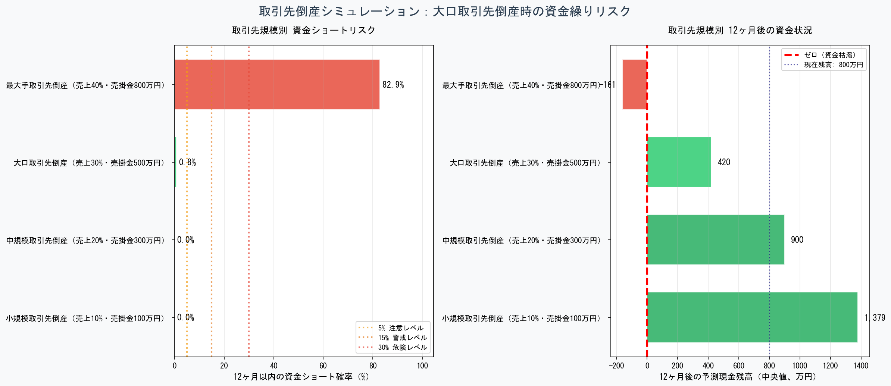
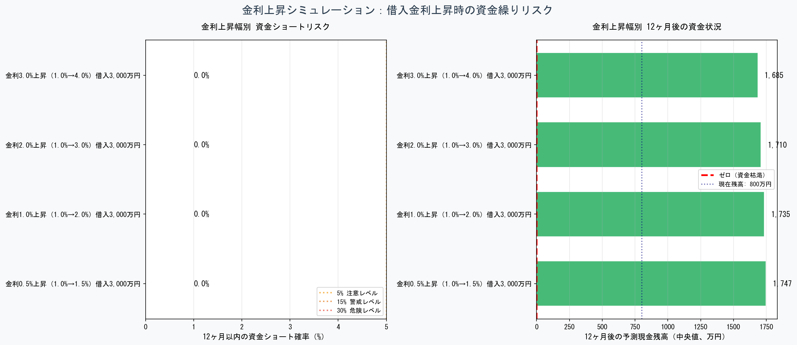
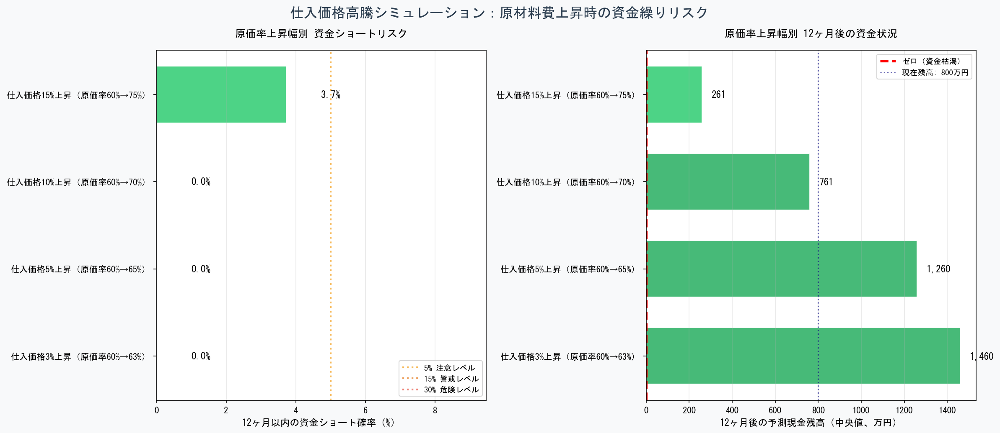

# 資金繰りリスク可視化ツール / Cash Flow Risk Analyzer

[](https://www.python.org/downloads/)
[](https://jupyter.org/)
[](LICENSE)

中小企業経営者の方へ——

このツールは、**社長が5分で答えられる項目を入力するだけ**で、売上の変動といった将来予測を自動で行います。

「来月は大丈夫だけど、この先どうなるのかな？」とお考えの社長さん。天気予報のような感覚で、この先の資金繰りのリスクを見てみませんか？

10,000通りの売上スケジュールを同時にシミュレーションし、資金繰りのリスクを「見える化」します。

---

## 🎯 このツールで何ができるか

### Phase 1: 資金ショート確率シミュレーター

- 📊 **資金繰りリスクの定量化**: 「3ヶ月以内に資金ショートする確率は15%」のように確率で表示
- 📈 **損益分岐点分析**: 売上が損益分岐点を下回る確率も同時に可視化
- 🎲 **モンテカルロ法**: 10,000通りの未来をシミュレーションして統計的に分析
- 🔍 **What-if分析**: 「固定費を20%削減したら？」などのシナリオ比較が可能

### Phase 2: ストレステスト完全版

#### Phase 2-1: 売上急落シミュレーション
- 🔥 **コロナショック・景気後退対応**: 突発的な売上減少に対する耐性評価
- 📉 **4つのシナリオ**: 軽度（20%減）、中度（30%減）、重度（50%減）、一時的ショック
- 🎯 **限界値の可視化**: 売上が何%減少すると資金ショートするかを明確化

#### Phase 2-2: 取引先倒産シミュレーション
- 💥 **連鎖倒産リスク**: 大口取引先の倒産による売掛金回収不能と売上減少の複合影響
- 📊 **4つの規模別シナリオ**: 小規模（売上10%）〜最大手（売上40%）
- 💰 **売掛金損失の影響**: 回収不能額と継続的売上減少を同時シミュレーション

#### Phase 2-3: 金利上昇シミュレーション
- 📈 **日銀政策変更対応**: 借入金利上昇による月次利払い増加の影響分析
- 💵 **4つの上昇幅**: 0.5%、1.0%、2.0%、3.0%の金利上昇シナリオ
- 🏦 **固定費増加効果**: 金利負担増による資金繰り圧迫を定量評価

#### Phase 2-4: 仕入価格高騰シミュレーション
- 📦 **インフレ対応**: 原材料費・仕入価格上昇による粗利率悪化の影響
- 📉 **4つの高騰幅**: 原価率3%、5%、10%、15%の上昇シナリオ
- 💹 **粗利圧迫効果**: キャッシュフロー減少の定量評価

### Phase 3: 改善策提案エンジン（2026年2月完成）

- 💡 **「では、どうすればいいか」を提案**: リスク可視化にとどまらず、具体的な改善策とその効果を定量評価
- 🏭 **業種別売掛サイトモデル**: 9業種の商慣行に基づく「短縮可能な下限」を設定。建設業・広告業など構造的に短縮困難な業種では無理な提案をしない
- 🏦 **資金調達オプションの3分類**: 当座貸越・短期借入・長期運転資金の使い分けを月次コストとセットで比較
- ⚖️ **効果と難易度をセットで表示**: 各施策に難易度（低〜実質困難）・実現期間・留意事項を必ず付記
- 🔬 **自動診断**: 現金水準・固定費比率・売掛サイトを診断し、優先すべき施策カテゴリを自動判定
- 🔗 **複数施策の組み合わせ試算**: 当座貸越＋固定費削減など、施策の組み合わせ効果をワンクリックで確認

**共通機能:**
- 🚨 **リスク判定**: 各シナリオを🟢安全・🟡注意・🟠警戒・🔴危険の4段階で自動判定
- 📊 **視覚的比較**: 横棒グラフで複数シナリオを一目で比較

---

## 🖼️ スクリーンショット

### メインダッシュボード（Phase 1）


### 感度分析（Phase 1: What-if シミュレーション）


### Phase 2 ストレステスト結果

#### Phase 2-1: 売上急落シナリオ


#### Phase 2-2: 取引先倒産リスク


#### Phase 2-3: 金利上昇リスク


#### Phase 2-4: 仕入価格高騰リスク


### Phase 3: 改善策提案ダッシュボード


---

## 🚀 クイックスタート

### 必要な環境

- Python 3.8 以上
- Jupyter Notebook（Anaconda推奨）

### インストール

```bash
# リポジトリをクローン
git clone https://github.com/atsushi0820/cashflow-risk-analyzer.git
cd cashflow-risk-analyzer

# 必要なパッケージをインストール
pip install -r requirements.txt

# Jupyter Notebookを起動
jupyter notebook
```

### 使い方

#### Phase 1〜3 統合版（推奨）

1. `cashflow_risk_analyzer_v3.ipynb` を開く
2. **セル4だけ**を編集して自社の数字と業種を入力
3. メニューから `Kernel` → `Restart & Run All` を実行
4. **グラフ7枚が自動生成されます**

| ファイル名 | 内容 |
|-----------|------|
| `01_資金繰りダッシュボード.png` | Phase 1 メインダッシュボード |
| `02_感度分析.png` | Phase 1 What-if分析 |
| `03_売上急落ストレステスト.png` | Phase 2-1 |
| `04_取引先倒産リスク.png` | Phase 2-2 |
| `05_金利上昇影響.png` | Phase 2-3 |
| `06_仕入高騰影響.png` | Phase 2-4 |
| `07_改善策提案ダッシュボード.png` | Phase 3 |

**パラメータ例（中小製造業）:**

```python
params = CashFlowParameters(
    monthly_sales=1000,           # 月次売上（万円）
    cash_balance=800,             # 現金残高（万円）
    monthly_fixed_cost=320,       # 月次固定費（万円）
    cost_rate=0.60,               # 売上原価率（60%）
    sales_volatility=0.15,        # 売上変動率（15%）
    accounts_receivable_days=30,  # 売掛サイト（日）
)

INDUSTRY = '製造業'   # 業種を選択するとARモデルが自動調整される
```

---

## 📊 出力ファイル

実行すると以下のファイルが自動生成されます。PowerPoint・Wordへの貼り付けや経営者への説明資料としてそのまま使えます。

### Phase 1

- `01_資金繰りダッシュボード.png` — 4枚組の分析グラフ
  - 現金残高の予測範囲（90%・50%信頼区間）
  - 月次資金ショート確率の推移
  - 最低残高の分布（10,000回シミュレーション）
  - 損益分岐点分析

- `02_感度分析.png` — シナリオ比較グラフ
  - 固定費削減・売上変動・現金積増の効果比較

### Phase 2（ストレステスト）

- `03_売上急落ストレステスト.png` — 4シナリオ比較
- `04_取引先倒産リスク.png` — 4規模比較（売掛金損失＋売上減少の複合影響）
- `05_金利上昇影響.png` — 借入金利上昇シナリオ
- `06_仕入高騰影響.png` — 原価率悪化シナリオ

### Phase 3（改善策提案）

- `07_改善策提案ダッシュボード.png` — 4パネル構成
  - 全施策の効果比較（色=難易度）
  - 上位8施策の実施後ショート確率
  - 資金調達オプション比較（効果 vs 月次コスト）
  - カテゴリ別推奨施策サマリー表

---

## 🏭 Phase 3: 業種別売掛サイトマスタ

業種の商慣行に基づく「短縮可能な下限」を設定しています。
下限を超えた短縮は「実質困難」と判定し、他の対策を優先して提案します。

| 業種 | 標準サイト | 短縮可能下限 |
|------|-----------|-------------|
| 建設業 | 75日 | 60日 |
| 製造業 | 52日 | 45日 |
| IT・システム開発 | 37日 | 30日 |
| 広告・マーケティング | 75日 | 60日 |
| 卸売・小売 | 45日 | 30日 |
| EC・SaaS | 15日 | 0日 |
| 医療・介護 | 45日 | 30日 |
| 士業・コンサル | 30日 | 14日 |

---

## 🎓 技術的な特徴

### モンテカルロ法による確率的シミュレーション

従来の資金繰り表は「単一のシナリオ」しか扱えませんが、このツールは：

- **10,000通りの売上シナリオ**を一度に計算
- 売上の変動を**正規分布**でモデル化（現実的な仮定）
- 資金ショート確率を**統計的に算出**

### 実務経験に基づく設計

- **入力項目は最小限**（8項目）: 社長が5分で答えられる
- **完全日本語対応**: 経営者・銀行員向けに最適化
- **業種別ARモデル**: 9業種の商慣行を反映

### コードの品質

- **PEP 8準拠**: Pythonコーディング規約に準拠
- **詳細なdocstring**: 各関数に使い方を明記
- **エラーハンドリング**: 入力値の妥当性チェック
- **可視化重視**: matplotlibで見やすいグラフを自動生成

---

## 📁 ファイル構成

```
cashflow-risk-analyzer/
├── cashflow_risk_analyzer_v3.ipynb   # Phase 1〜3 統合版（推奨）
├── README.md                          # このファイル
├── requirements.txt                   # 必要パッケージ
├── LICENSE                            # MITライセンス
├── images/                            # サンプル画像
│   ├── dashboard_sample.png          # Phase 1 ダッシュボード
│   ├── sensitivity_sample.png        # Phase 1 感度分析
│   ├── stress_test_sample.png        # Phase 2-1 売上急落
│   ├── bankruptcy_risk_sample.png    # Phase 2-2 取引先倒産
│   ├── interest_rate_risk_sample.png # Phase 2-3 金利上昇
│   ├── cost_inflation_risk_sample.png# Phase 2-4 仕入価格高騰
│   └── improvement_sample.png        # Phase 3 改善策提案
└── docs/                              # ドキュメント
    └── 使い方ガイド.pptx
```

---

## 🔧 業種別パラメータの目安

| 業種 | 原価率 | 変動率 | 売掛サイト |
|------|--------|--------|------------|
| 製造業 | 60-70% | 10-15% | 30-60日 |
| 飲食業 | 65-75% | 20-30% | 0日（現金） |
| 小売業 | 70-80% | 15-20% | 0-30日 |
| サービス業 | 30-50% | 10-15% | 30-45日 |
| 建設業 | 80-85% | 25-35% | 60-90日 |

---

## 🛠️ 開発状況

### ✅ Phase 1: 基本シミュレーター（完了）
- ✅ モンテカルロ・シミュレーション（10,000回）
- ✅ 損益分岐点分析
- ✅ What-if感度分析

### ✅ Phase 2: ストレステスト完全版（完了 - 2026年2月）
- ✅ Phase 2-1: 売上急落シミュレーション（4シナリオ）
- ✅ Phase 2-2: 取引先倒産シミュレーション（4シナリオ）
- ✅ Phase 2-3: 金利上昇シミュレーション（4シナリオ）
- ✅ Phase 2-4: 仕入価格高騰シミュレーション（4シナリオ）

### ✅ Phase 3: 改善策提案エンジン（完了 - 2026年2月）
- ✅ 業種別売掛サイトモデル（9業種）
- ✅ 資金調達オプション3分類（当座貸越・短期借入・長期運転資金）
- ✅ 難易度・月次コスト・実現期間の自動算出
- ✅ 企業状況の自動診断
- ✅ 複数施策の組み合わせ試算
- ✅ Phase 1〜3 統合ノートブック（`cashflow_risk_analyzer_v3.ipynb`）

### Phase 4: Excel連携（予定）
- openpyxlでExcelから直接データ読込
- 結果をExcelに自動出力

### Phase 5: WebUI（予定）
- Streamlitによるブラウザ操作対応

---

## 📖 ドキュメント

- [使い方ガイド（PowerPoint）](docs/使い方ガイド.pptx)
- [技術解説（準備中）](#)
- [よくある質問（準備中）](#)

---

## 🤝 貢献

Issue報告やPull Requestを歓迎します。

---

## 📜 ライセンス

[MIT License](LICENSE) - 商用利用・改変・再配布が自由です。

---

## 👤 開発者

**金融実務経験20年**

- J信用金庫（融資審査）
- T社（企業評価）
- 70万社のデータ分析経験
- 中央官庁の公開報告書（実績証明）

---

## 🙏 謝辞

モンテカルロ法の実装にあたり、NumPyの公式ドキュメントおよび統計学の標準的な手法を参考にしました。

---

⭐ このプロジェクトが役に立ったら、ぜひStarをつけてください！

---

**作成日:** 2026年2月  
**バージョン:** v3.0（Phase 1〜3 統合版）  
**最終更新:** 2026年2月20日
