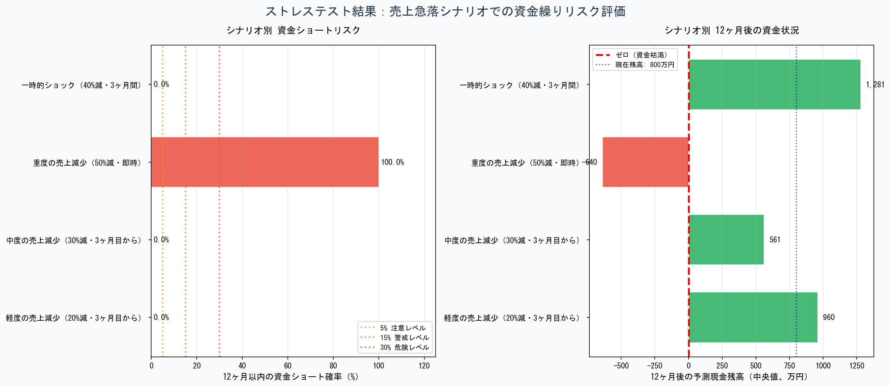

# 資金繰りリスク可視化ツール / Cash Flow Risk Analyzer

[](https://www.python.org/downloads/)
[](https://jupyter.org/)
[](LICENSE)

**中小企業の資金繰りリスクを「天気予報」のように確率で可視化するツール**

モンテカルロ法を用いて、10,000通りの売上シナリオをシミュレーションし、資金ショート確率を定量的に算出します。

---

## 🎯 このツールで何ができるか

### Phase 1: 資金ショート確率シミュレーター

- 📊 **資金繰りリスクの定量化**: 「3ヶ月以内に資金ショートする確率は15%」のように確率で表示
- 📈 **損益分岐点分析**: 売上が損益分岐点を下回る確率も同時に可視化
- 🎲 **モンテカルロ法**: 10,000通りの未来をシミュレーションして統計的に分析
- 🔍 **What-if分析**: 「固定費を20%削減したら？」などのシナリオ比較が可能

### Phase 2: ストレステスト（2026年2月追加）

- 🔥 **売上急落シナリオ**: コロナショック・景気後退を想定した突発的な売上減少に対する耐性評価
- 📉 **4つの事前定義シナリオ**: 軽度（20%減）、中度（30%減）、重度（50%減）、一時的ショック
- 🎯 **限界値の可視化**: 「売上が何%減少すると資金ショートするか」が一目でわかる
- 🚨 **リスク判定**: 各シナリオを🟢安全・🟡注意・🟠警戒・🔴危険の4段階で自動判定

---

## 🖼️ スクリーンショット

### メインダッシュボード（Phase 1）


### 感度分析（Phase 1: What-if シミュレーション）


### ストレステスト結果（Phase 2: 売上急落シナリオ）


---

## 🚀 クイックスタート

### 必要な環境

- Python 3.8 以上
- Jupyter Notebook（Anaconda推奨）

### インストール

```bash
# リポジトリをクローン
git clone https://github.com/あなたのユーザー名/cashflow-risk-analyzer.git
cd cashflow-risk-analyzer

# 必要なパッケージをインストール
pip install -r requirements.txt

# Jupyter Notebookを起動
jupyter notebook
```

### 使い方

#### Phase 1 + Phase 2（推奨）

1. `cashflow_simulator_phase1_phase2.ipynb` を開く
2. **セル3** のパラメータを自社の数字に変更
3. メニューから `Kernel` → `Restart & Run All` を実行
4. Phase 1のグラフ（2枚）とPhase 2のストレステスト結果（1枚）が自動生成されます

#### Phase 1のみ

1. `phase1_資金繰りシミュレーター_日本語版.ipynb` を開く
2. **セル3** のパラメータを自社の数字に変更
3. メニューから `Kernel` → `Restart & Run All` を実行
4. グラフが自動生成されます

**パラメータ例（中小製造業）:**

```python
params = CashFlowParameters(
    monthly_sales=1000,           # 月次売上（万円）
    cash_balance=800,             # 現金残高（万円）
    monthly_fixed_cost=320,       # 月次固定費（万円）
    cost_rate=0.60,               # 売上原価率（60%）
    sales_volatility=0.15,        # 売上変動率（15%）
    accounts_receivable_days=30,  # 売掛サイト（日）
)
```

---

## 📊 出力ファイル

実行すると、以下のファイルが自動生成されます：

### Phase 1

- `資金繰りダッシュボード.png` - 4枚組の分析グラフ
  - 現金残高の予測範囲
  - 月次資金ショート確率
  - 最低残高の分布
  - 損益分岐点分析

- `感度分析.png` - シナリオ比較グラフ
  - 固定費削減の効果
  - 売上減少時のリスク
  - 各種改善策の比較

### Phase 2（ストレステスト）

- `ストレステスト結果.png` - 売上急落シナリオ比較
  - 4シナリオの資金ショート確率（横棒グラフ）
  - 12ヶ月後の予測残高（横棒グラフ）
  - リスク判定（🟢🟡🟠🔴）

---

## 🎓 技術的な特徴

### モンテカルロ法による確率的シミュレーション

従来の資金繰り表は「単一のシナリオ」しか扱えませんが、このツールは：

- **10,000通りの売上シナリオ**を一度に計算
- 売上の変動を**正規分布**でモデル化（現実的な仮定）
- 資金ショート確率を**統計的に算出**

### 実務経験に基づく設計

- **入力項目は最小限**（5-6項目）: 社長が5分で答えられる
- **完全日本語対応**: 経営者・銀行員向けに最適化
- **業種別パラメータ**: 製造業・飲食業・小売業など

### コードの品質

- **PEP 8準拠**: Pythonコーディング規約に準拠
- **詳細なdocstring**: 各関数に使い方を明記
- **エラーハンドリング**: 入力値の妥当性チェック
- **可視化重視**: matplotlibで見やすいグラフを自動生成

---

## 📁 ファイル構成

```
cashflow-risk-analyzer/
├── cashflow_simulator_phase1_phase2.ipynb         # Phase 1 + 2 統合版（推奨）
├── phase1_資金繰りシミュレーター_日本語版.ipynb  # Phase 1のみ
├── README.md                                      # このファイル
├── requirements.txt                               # 必要パッケージ
├── LICENSE                                        # MITライセンス
├── images/                                        # サンプル画像
│   ├── dashboard_sample.png                      # Phase 1 ダッシュボード
│   ├── sensitivity_sample.png                    # Phase 1 感度分析
│   └── stress_test_sample.png                    # Phase 2 ストレステスト
└── docs/                                          # ドキュメント
    └── 使い方ガイド.pptx
```

---

## 🔧 業種別パラメータの目安

| 業種 | 原価率 | 変動率 | 売掛サイト |
|------|--------|--------|------------|
| 製造業 | 60-70% | 10-15% | 30-60日 |
| 飲食業 | 65-75% | 20-30% | 0日（現金） |
| 小売業 | 70-80% | 15-20% | 0-30日 |
| サービス業 | 30-50% | 10-15% | 30-45日 |
| 建設業 | 80-85% | 25-35% | 60-90日 |

---

## 🛠️ 今後の開発予定

### ✅ Phase 2: ストレステスト（完了 - 2026年2月）
- ✅ 売上急落シミュレーション（4シナリオ）
- ✅ リスク判定機能（🟢🟡🟠🔴）
- ✅ 完全日本語対応ダッシュボード

### Phase 3: 追加ストレステスト（予定）
- 取引先倒産シミュレーション
- 金利上昇の影響分析
- 仕入価格高騰の影響
- 売上急落時の資金繰り

### Phase 3: 改善策提案エンジン
- 回収サイト短縮の効果試算
- 在庫圧縮の効果
- リスケジュール（返済条件変更）の影響

### Phase 4: Excel連携
- openpyxlでExcelから直接データ読込
- 結果をExcelに自動出力

---

## 📖 ドキュメント

- [使い方ガイド（PowerPoint）](docs/使い方ガイド.pptx)
- [技術解説（準備中）](#)
- [よくある質問（準備中）](#)

---

## 🤝 貢献

Issue報告やPull Requestを歓迎します。

### 開発環境のセットアップ

```bash
# リポジトリをクローン
git clone https://github.com/あなたのユーザー名/cashflow-risk-analyzer.git
cd cashflow-risk-analyzer

# 仮想環境を作成（推奨）
python -m venv venv
source venv/bin/activate  # Windows: venv\Scripts\activate

# 開発用パッケージをインストール
pip install -r requirements.txt
```

---

## 📜 ライセンス

[MIT License](LICENSE) - 商用利用・改変・再配布が自由です。

---

## 👤 開発者

**T社 金融実務経験20年**

- J信用金庫（融資審査）
- T社（企業評価）
- 70万社のデータ分析経験
- 中央官庁の公開報告書（実績証明）

### 連絡先

- GitHub: [@あなたのユーザー名](https://github.com/あなたのユーザー名)
- LinkedIn: [プロフィールURL]（オプション）

---

## 🙏 謝辞

このツールは、20年間の金融実務で見てきた「資金繰り表を作っていない中小企業」が多い現実を踏まえ、
**5分で入力できる最小限の項目**で実用的なリスク分析を可能にすることを目指して開発しました。

モンテカルロ法の実装にあたっては、NumPyの公式ドキュメントと統計学の標準的な手法を参考にしています。

---

## ⭐ Star歓迎

このプロジェクトが役に立ったら、ぜひ⭐をつけてください！

---

**作成日:** 2026年2月  
**バージョン:** Phase 2.0（ストレステスト追加）  
**最終更新:** 2026年2月18日
